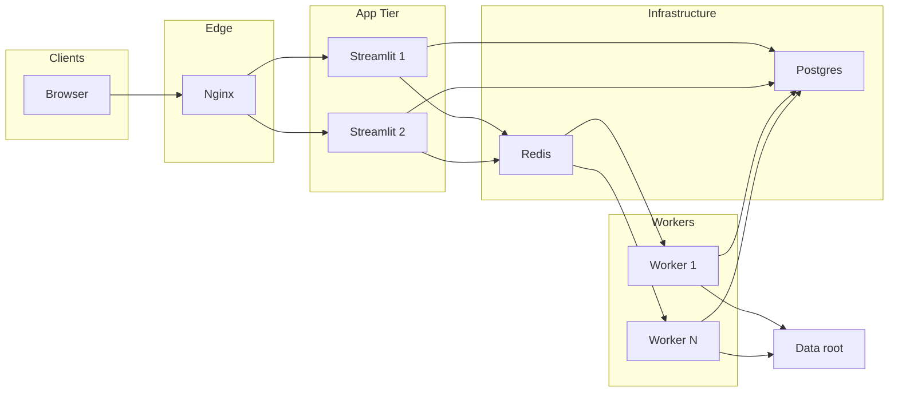

# 評価ダッシュボード

## 必須インストール

本ダッシュボード・評価ツールの動作には、以下の前提と Python パッケージが必要です。  

### Python パッケージ（ローカル開発・フル機能）
リポジトリ直下で次のように **1 本の requirements** から入れるのが簡単です（プライベート依存あり）。

```sh
cd evaluation_dashboard_app
pip install -r requirements.txt
```

手動で分けて入れる場合の例:

```sh
# 基本
pip install \
  streamlit pandas plotly duckdb numpy \
  requests pyyaml matplotlib shapely

# Download/Scenario API 認証
pip install git+ssh://git@github.com/tier4/webauto-auth-py.git

# 本番タスクキュー（USE_TASK_QUEUE=true のとき）
pip install rq psycopg2-binary
```

**Docker イメージ**では、公開依存は [`requirements-docker.txt`](requirements-docker.txt) で入り、ビルド時の SSH シークレットで webauto-auth・評価系のプライベートパッケージを追加インストールします（[`Dockerfile`](Dockerfile) 参照）。

```sh
# Install CLI tool (評価実行コマンド生成で利用する場合)
pipx install git+ssh://git@github.com/tier4/v_and_v_util.git
```

### pilot-auto / perception_eval（Summary/Score 生成時のみ）
- `perception_eval` が使える pilot-auto 環境が必要です（下記「使い方」参照）
- `perception_eval` の import が失敗すると `Summary.csv` / `Score.csv` 生成が停止します

### 設定ファイル
- `configs/autoware_evaluator_dl_config.json` に入力値を保存します（自動生成/更新）

## 概要
Streamlit で動作する評価ダッシュボードです。`data/` 配下の評価結果（`Summary.csv`、`Score.csv`、`.parquet`）を読み込み、複数ページで可視化できます。さらに、`pages/6_Download.py` では評価結果（`result.txt` など）の一括集計や `Summary.csv` / `Score.csv` の自動生成、結果ディレクトリの検索・ダウンロード管理も可能です。**TLR (Traffic Light Recognition) Analysis** ページでは、シグナル認識評価の criteria マトリクス・車両状態 vs 信号種別・重要ゾーンなどを可視化でき、利用するには **Download ページのタブ 2「Download Scenarios」** でシナリオデータを事前にダウンロードしておく必要があります。

## 使い方

1. サマリーやスコア生成（`pages/6_Download.py` の「Summary.csv / Score.csv を生成」）を実行するには、**事前に下記コマンドで pilot-auto（ROS 2）環境を有効化する必要があります**:
   ```
   source path_to_pilot/install/setup.sh
   ```
   ※ この作業は `pages/6_Download.py` の「Summary/Score CSV 生成」で必要です。

2. `evaluation_dashboard_app/` で Streamlit を起動します。
   ```
   streamlit run Overview.py
   ```

3. サイドバーからページやフィルタを選択して可視化します。

### 可視化のクイックスタート（推奨ワークフロー）

あるテストのログを取得してから、サマリーを生成し、Overview で詳細を確認するまでの流れは次の 3 ステップです。

1. **Download ページで特定テストのログをダウンロードする**
2. **Download ページの「Eval Results」でサマリー／スコアを生成する**
3. **Overview ページでそのログ（Run）を選択し、詳細を表示する**

以下、各ステップで行うことと、注意点をまとめます。

#### ステップ 1: Download ページでログをダウンロードする

- **ページ**: サイドバーから **Download**（`6_Download.py`）を開く。
- **タブ**: **「Download Results」** を選択する。
- **入力**:
  - **Project ID** と **Job ID** を入力する（必要に応じて Suite ID も指定）。
  - **Output Path** には、**このテスト用のフォルダ**を指定する。  
    Overview で「Run」として選べるようにするには、`data/` の直下に 1 テスト 1 フォルダで置くのがおすすめです。  
    例: `./data/my_test_20250203` のように `./data/<テスト名>` とする。
- **Download Type**:
  - **Archives (ZIP)**: ZIP をダウンロードして解凍し、指定 Phase のデータを取り出す。ローカルでフルに解析する場合向け。
  - **Result JSON only**: 結果 JSON のみ取得。軽量で、サマリー／スコア生成だけしたい場合向け。
- **実行**: 「Download Results」をクリックし、完了するまで待つ。
- 
- **結果**: 指定した Output Path の下に、ジョブ／スイートに応じたディレクトリ構造でログ（および必要に応じて `result.txt`・`score.json` の元データ）が保存される。


#### ステップ 2: Eval Results でサマリー分析結果を生成する

- **ページ**: 同じ **Download** ページのまま。
- **タブ**: **「Eval Results (per directory)」**（または「Eval Results」）に切り替える。
- **Root directory to evaluate**:
  - ステップ 1 でダウンロード先に指定した **Output Path と同じパス**を指定する。  
    例: `./data/my_test_20250203`
- **オプション**:
  - **Search subdirectories**: サブディレクトリも検索して `result.txt` / `score.json` を探す。通常はオンでよい。
  - **Only generate Summary.csv and Score.csv**:  
    既に各ディレクトリに `result.txt` や `score.json` がある場合にチェックすると、`perception_eval` の再実行をスキップし、既存結果から **Summary.csv** と **Score.csv** だけを生成する。  
    初回で `result.txt` などがまだない場合はチェックせず、「Run eval_result for all directories」でフル評価を実行する。
- **実行**:
  - 「Run eval_result for all directories」または「Generate Summary and Score CSV only」をクリックする。
- **結果**: 指定したルートディレクトリ直下に **Summary.csv** と **Score.csv** が生成される。  
  これが「サマリー分析結果」であり、Overview および TP Summary / Criteria Based Score など各ページが参照するデータになる。


※ Summary/Score 生成時に `perception_eval` を使う場合は、事前に pilot-auto 環境の `source path_to_pilot/install/setup.sh` を実行しておく必要があります（「使い方」参照）。

#### ステップ 3: Overview ページでログを選んで詳細を表示する

- **ページ**: サイドバーから **Overview**（`Overview.py`）を開く。
- **Run の選択**:
  - Overview は `data/` 直下の **各サブディレクトリ**を 1 つの「Run」として扱う。
  - ステップ 1 の Output Path を `./data/<テスト名>` にしていた場合、その `<テスト名>` がサイドバーの **「Baseline (A)」** のドロップダウンに表示される。
  - 表示したいテストのログ（Run）を **Baseline (A)** で選択する。比較したい場合は **Compare Mode** にし、**Candidate (B)** にもう 1 つの Run を選ぶ。
- **表示内容**:
  - 選択した Run の **Summary.csv** に基づく全体指標（TP mean、XRMS / YRMS / XSTD / YSTD など）が表示される。
  - Perception Label / Product Label でフィルタすると、ラベル別の TP や指標の内訳を確認できる。
  - 他のページ（TP Summary、Criteria Based Score、Detection Stats、Bounding Box Viewer）は、この Overview で選んだ Run を `st.session_state` で共有しているため、**先に Overview で Run を選んでから**各ページに移動すると、同じテストの詳細が表示される。


**ポイント**:
- 新しいテストを追加するたびに、Download では **Output Path を `./data/<新しいテスト名>`** にし、Eval Results で同じパスを「Root directory to evaluate」に指定して Summary/Score を生成すると、Overview の Run 一覧にそのテストが現れ、選択するだけで詳細を追える。

## 主な機能
- 概要ページで Run の選択、単体/比較モードの切替、全体指標を表示
- 本番タスクキュー利用時は、重い処理の状態を UI（Recent tasks 等）から追跡
- TP/位置/速度の統計ビューア（散布図・分布）
- Criteria-based の評価ビューア（指標分布・平均・箱ひげ）
- 検出統計の比較ビューア（TP/FP の距離ビン比較など）
- BEV のバウンディングボックス可視化
- TLR (Traffic Light Recognition) 評価分析（criteria マトリクス・車両状態 vs 信号種別・重要ゾーン；要・Download ページタブ 2 でシナリオデータ取得）
- 評価実行コマンドの生成ツール
- **Docker 本番**: Overview から **Deployment debug**（Postgres/Redis/RQ・任意で Docker 操作）へ遷移

## ディレクトリ構成
```
evaluation_dashboard_app/
  Overview.py
  pages/
    1_TP_Summary.py … 10_Help.py、99_Deployment_Debug.py（番号順がサイドバー順）
  lib/
  worker/            # 本番: RQ タスクとワーカーエントリ
  configs/
    autoware_evaluator_dl_config.json
  deploy/            # 本番: compose, nginx, 番号付きシェル手順
    docker-compose.yml
    .env.example
    01_SETUP_ENV.sh ... 09_RESTART_WORKER.sh
    configs/
      autoware_evaluator_dl_config.json   # compose 時はコンテナ内 /app/docker_config にマウント
    nginx/
  data/
    <run_id>/
      Summary.csv
      Score.csv
    *.parquet
```

## ページ説明

サイドバーに並ぶのは **`pages/` 直下の `数字_名前.py`** の番号順です。**Deployment debug**（`99_Deployment_Debug.py`）は `st.page_link` 登録のため直下に置く必要があり、**Docker 外**では `inject_app_page_styles` がサイドバー該当リンクを CSS で非表示にします。Docker 内では **Overview** に明示リンクがあります。

多くの可視化ページは **先に Overview でモード（単体 / 比較）と Run を選ぶ**と `st.session_state` が揃います。比較モードでは Baseline (A) と Candidate (B…) を共有します。

### `Overview.py`（エントリ）
- 単体 / 比較モード、Run 選択、Perception・Product ラベルなど **共通フィルタ**の起点。
- **共有 URL**: クエリ `mode`, `run_a`, `run_b`… で同じ表示を再現可能（他ページも同様のパターンを使うものあり）。
- Docker で起動しているとき、サイドバーに **Deployment debug** へのリンクが出ます（`pages/99_Deployment_Debug.py`）。

### `pages/1_TP_Summary.py`
- **前提**: Overview でデータ読み込み済み。**`Summary.csv` 必須**（無い Run では TP Summary は使えず、Detection Stats / BB Viewer は parquet のみでも可、という案内あり）。
- Compare モードでは複数 Run 間の **差分（delta）** をプロットに反映可能。
- `TP` レンジ、速度の外れ値クリップ、散布図（`xrms`–`yrms`、`vx`–`vy`）、分布ヒストグラム。

### `pages/2_Criteria_Based_Score.py`
- **`Score.csv` ベース**の criteria 評価ビュー。Overview のモードに追従。
- Criteria ブロックの切替、指標の分布・グループ平均・箱ひげ、シナリオ単位の比較。
- **Absolute gates**（しきい値による合否サインオフ）や、複数 Run のゲート比較 UI あり。

### `pages/3_Detection_Stats.py`
- **`.parquet` + DuckDB** で検出評価を集計。フィルタ、階層ビュー、シナリオ分解、**複数 Run の比較**（Overview で Compare を選んだ場合）。
- TP/FP などステータス別の距離ビン比較、知覚 diff 用の配色（改善/悪化）など。

### `pages/4_Bounding_Box_Viewer.py`
- **前提**: Overview で Run 選択済み。
- `.parquet` の **BEV** 上にバウンディングボックスを表示。t4dataset / topic / label / visibility などで絞り込み。Compare 時は複数 Run を扱う。

### `pages/5_Tools.py`
- 評価実行コマンド生成ツール
- Report/Suite URL から Job ID / Suite ID を抽出

### `pages/6_Download.py`
- Evaluator 連携の中心。**タブ構成**は次のとおりです。

  | タブ | 内容 |
  |------|------|
  | **Download Results** | ジョブ結果の取得（アーカイブ ZIP や Result JSON など）。Output Path はデータルート配下に制限。 |
  | **Download Scenarios** | シナリオデータ取得。**TLR Analysis** で必要。 |
  | **View Downloads** | 取得済みジョブ・シナリオの確認。 |
  | **Eval Results** | ルートディレクトリ配下の `result.txt` / `score.json` から評価実行や **Summary.csv / Score.csv 生成**。 |

- **`USE_TASK_QUEUE=true`**（Redis + Worker + Postgres）のとき、重い処理はワーカー側にキューイングされ、画面上で **Recent tasks** などから状態を追えます。

### `pages/7_Data_Management.py`
- データルート直下の **Run 一覧**（サイズ・更新日時、Summary/Score/Parquet の有無）。
- 成果物を **ZIP でまとめてダウンロード**、Overview 用 **共有リンクのコピー**、Run **削除**（容量管理）。サーバ複数人運用向け。

### `pages/8_Parquet_Debug.py`
- 開発・トラブルシュート用。**`.parquet` / `.pkl` / `result.json`** をファイルパスから読み、スキーマ・キー・criteria 状態などを確認。必要に応じて簡易プロット。
- パイプライン出力をダッシュボード内で切り分ける用途。

### `pages/9_TLR_Analysis.py`
- **TLR (Traffic Light Recognition)** 評価: criteria マトリクス、車両状態 vs 信号種別、重要ゾーンなど。単体 / 比較、**共有 URL**（`mode`, `path_a`, `path_b` など）。
- **前提**: **Download** の **Download Scenarios** でシナリオデータを取得し、TLR 結果ディレクトリを Run として選ぶ。

### `pages/10_Help.py`
- リポジトリの **`Readme.md` をアプリ内に表示**（セットアップ・ワークフロー・本 README の内容をブラウザだけで参照）。
- Markdown 内の **Mermaid 図**は Streamlit 標準では描画されないため、本ページでは JS（Mermaid.js）でレンダリングします。

### `pages/99_Deployment_Debug.py`（Docker 実行時のみ）
- **コンテナ内**で Streamlit を動かしているときだけ利用可能（ローカル `streamlit run` では案内メッセージで停止）。
- `st.page_link` 用に **直下の** `pages/*.py` として登録する必要があるため、Docker 外では **自動ナビの該当項目を CSS で非表示**にしています。**Docker 時は Overview のサイドバーから「Deployment debug」** でも開けます。
- Postgres / Redis / RQ の状態、タスク件数、（設定により）ホストの Docker コンテナ一覧・ログ末尾・限定された `docker exec` などを確認できます。
- 本番では **Docker ソケットをマウントする運用は強い権限**になるため、認証・VPN・`EVAL_DEPLOYMENT_DEBUG_*` の設定は [docs/PRODUCTION_DEPLOYMENT.md](docs/PRODUCTION_DEPLOYMENT.md) の環境変数表を参照してください。

## データ形式（概略）
- `Summary.csv`: `id`, `TP`, `xstd`, `xrms`, `ystd`, `yrms`, `vx`, `vy`, `perception_label`, `product_label`
- `Score.csv`: Criteria ごとの評価指標ブロック（`Scenario`, `Option`, `GT_OBJ`, 以降は criteria0..n）
- `.parquet`: 検出統計/BB 表示に必要な `x`, `y`, `length`, `width`, `yaw`, `label`, `source`, `status` など

# Docker 利用ガイド

イメージは **ROS ベース**なので、ホストと同じ ROS 環境になります。

### ビルド手順

プライベートリポジトリ（tier4/webauto-auth-py, tier4/v_and_v_util）のため、**GitHub SSH鍵**をビルド時に渡す必要があります。  
`~/.ssh/id_rsa` を指定してください（ssh-agent 不要）。

```sh
cd evaluation_dashboard_app

# [推奨] 毎回最新依存にしたい場合は --no-cache を指定します。
# ROSが Humbleの場合（省略可）
docker build --no-cache --secret id=ssh,src=$HOME/.ssh/id_rsa -t evaluation-dashboard .

# ROS ディストロを Iron/Jazzy 等に切り替えたい場合
docker build --build-arg ROS_DISTRO=iron --secret id=ssh,src=$HOME/.ssh/id_rsa -t evaluation-dashboard .
```

### 本番デプロイ（Production deployment）

複数ユーザー・本番運用では **Nginx → Streamlit → Redis（タスクキュー）→ Worker → Postgres** 構成を推奨します。重い処理（ダウンロード・評価・Summary/Score CSV 生成・parquet 生成）は UI ではなく Worker で実行され、タスク状態は Postgres に保存されます。

**Target Architecture:**



- **ビルド**: 上記「ビルド手順」のとおり `evaluation_dashboard_app/` で `docker build ... -t evaluation-dashboard .`（compose の `streamlit` / `worker` はこのイメージを参照します）。
- **推奨フロー（`deploy/` の番号付きスクリプト）**: `deploy/` に移動して順に実行します（すべて `docker compose --env-file .env` を使います）。

  | スクリプト | 内容 |
  |-----------|------|
  | `01_SETUP_ENV.sh` | `.env` が無ければ `.env.example` から作成（**編集は手動**） |
  | `02_BUILD.sh` | イメージビルド（引数で `--no-cache` など可） |
  | `03_INIT_DB.sh` | **初回のみ**: Postgres 起動後に `init_db` でタスク用テーブル作成 |
  | `04_START.sh` | スタック起動（例: `./04_START.sh --scale worker=3`） |
  | `05_STOP.sh` | 停止 |
  | `06_STATUS.sh` | 状態確認 |
  | `07_LOGS.sh` | `docker compose logs -f`（省略時は全サービス、例: `./07_LOGS.sh worker`） |
  | `08_REBUILD_AND_START.sh` | ビルド後に `up -d` |
  | `09_RESTART_WORKER.sh` | ワーカー再起動（コード変更を worker に反映） |

- **手動でも同じことは可能**: `cd deploy && cp .env.example .env` → `.env` を編集 → `docker compose --env-file .env up -d`。初回のみ `docker compose --env-file .env run --rm init_db`（`03_INIT_DB.sh` と同等）。
- **アクセス**: 本番 compose では **Nginx がポート 80**、Streamlit はプロキシ経由（`docker-compose.yml` / `nginx/nginx.conf` 参照）。ソースや `lib/` はマウントされているため **Streamlit はファイル変更でリロード**しやすい一方、**ワーカーは Python 変更後に再起動**が必要です。
- **設定の二重管理を避ける**: compose 実行時は `deploy/configs/autoware_evaluator_dl_config.json` がコンテナ内 `EVAL_DASHBOARD_CONFIG`（`/app/docker_config/...`）としてマウントされます。ホストの `configs/` とは別ファイルなので、Docker 用に変えたい値はこちらを編集します。
- 詳細・環境変数一覧は [docs/PRODUCTION_DEPLOYMENT.md](docs/PRODUCTION_DEPLOYMENT.md) を参照してください。

### 起動とデータマウント（単体コンテナ）

データを永続化・可視化するため、`data/` ディレクトリを必ずマウントしてください。

```sh
docker run -p 8501:8501 \
  -v "$(pwd)/data:/app/data" \
  -v ~/.webauto:/root/.webauto \
  evaluation-dashboard
```

### バックグラウンドでの起動例（-d オプション）

コンテナをバックグラウンド（デタッチド）で起動したい場合は、`-d` オプションを追加し、`--name` でコンテナ名も指定できます。  
コードやノートブックも含めて `/app` 配下をホストと同期する場合は以下のようにします。

```sh
docker run -d --name evaluation-dashboard \
  -p 8501:8501 \
  -v "$(pwd):/app" \
  -v ~/.webauto:/root/.webauto \
  evaluation-dashboard
```

### 複数ユーザーでサーバー運用する場合（Multi-User Deployment）

複数人が同じサーバーにアクセスしてダウンロード・評価・結果確認・共有・データ管理を行う場合は、以下を参照してください。

- **データルート**: 環境変数 `EVAL_DASHBOARD_DATA_ROOT` で評価データのルートを指定できます（省略時は `data`）。例: `-e EVAL_DASHBOARD_DATA_ROOT=/var/eval_dashboard/data`
- **パス制限**: ダウンロードの Output Path と Eval の Root directory は、このデータルート配下に制限され、パストラバーサルは拒否されます。
- **Data Management ページ**: Run 一覧・サイズ表示・削除・共有リンクのコピーができます。不要な Run を削除して容量を管理できます。
- **結果の共有**: Overview の URL に `?mode=...&run_a=...&run_b=...` を付けると、同じ Run 表示を共有できます。Data Management や Overview の「Share this view」でリンクをコピーできます。
- 詳細は [docs/MULTI_USER_DEPLOYMENT.md](docs/MULTI_USER_DEPLOYMENT.md) を参照してください。

### デバッグ・シェルアクセス

実行中のコンテナにシェルで入りたい場合は、以下いずれかの方法を利用できます。

**1. コンテナIDで bash に入る：**
```sh
docker ps         # [CONTAINER ID]を確認
docker exec -it [CONTAINER ID] /bin/bash
```

**2. 起動時、直接 bash で入る：**
```sh
docker run -it --entrypoint bash \
  -v "$(pwd)/data:/app/data" \
  evaluation-dashboard
```
