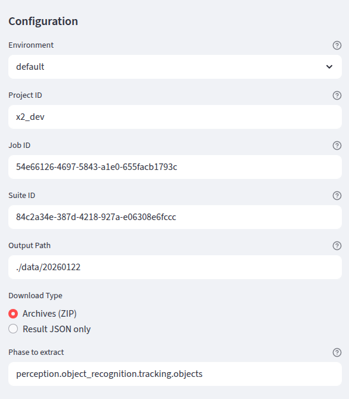
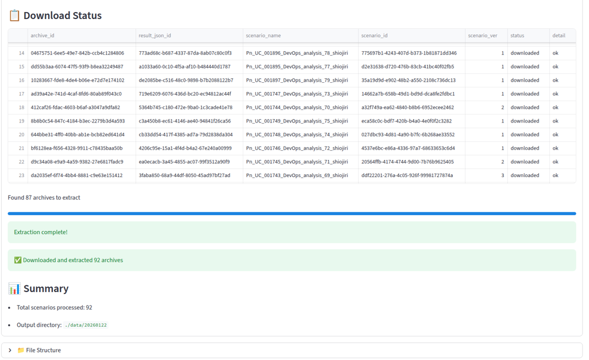
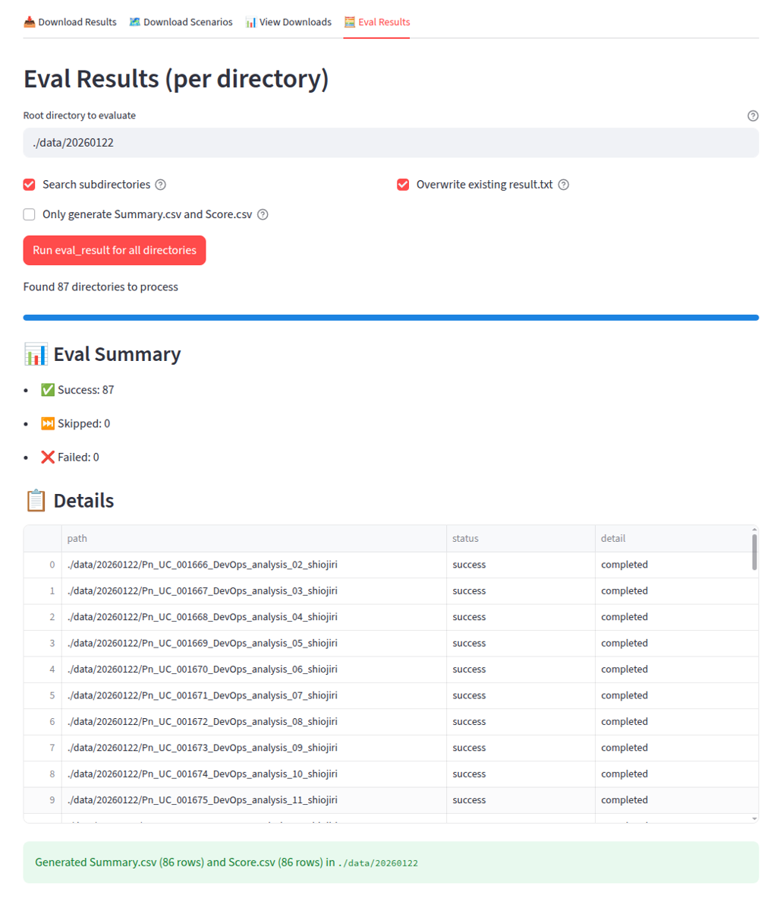
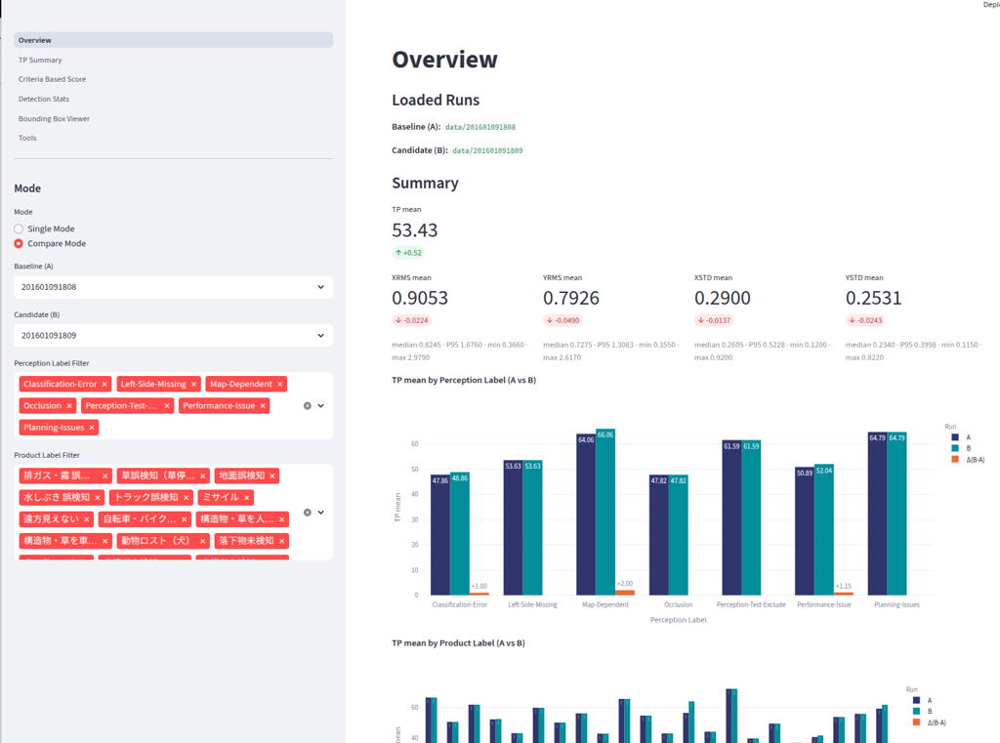

# 評価ダッシュボード

## 必須インストール

本ダッシュボード・評価ツールの動作には、以下の前提と Python パッケージが必要です。  


### Python パッケージ（基本機能）
```sh
pip install \
  streamlit pandas plotly duckdb numpy \
  requests pyyaml matplotlib shapely
```

### Python パッケージ（ダウンロード機能）
```sh
# Install authentication library (Download/Scenario API)
pip install git+ssh://git@github.com/tier4/webauto-auth-py.git
```

```sh
# Install CLI tool (評価実行コマンド生成で利用する場合)
pipx install git+ssh://git@github.com/tier4/v_and_v_util.git
```

### pilot-auto / perception_eval（Summary/Score 生成時のみ）
- `perception_eval` が使える pilot-auto 環境が必要です（下記「使い方」参照）
- `perception_eval` の import が失敗すると `Summary.csv` / `Score.csv` 生成が停止します

### 設定ファイル
- `configs/autoware_evaluator_dl_config.json` に入力値を保存します（自動生成/更新）

## 概要
Streamlit で動作する評価ダッシュボードです。`data/` 配下の評価結果（`Summary.csv`、`Score.csv`、`.parquet`）を読み込み、複数ページで可視化できます。さらに、`pages/6_Download.py` では評価結果（`result.txt` など）の一括集計や `Summary.csv` / `Score.csv` の自動生成、結果ディレクトリの検索・ダウンロード管理も可能です。

## 使い方

1. サマリーやスコア生成（`pages/6_Download.py` の「Summary.csv / Score.csv を生成」）を実行するには、**事前に下記コマンドで pilot-auto（ROS 2）環境を有効化する必要があります**:
   ```
   source path_to_pilot/install/setup.sh
   ```
   ※ この作業は `pages/6_Download.py` の「Summary/Score CSV 生成」で必要です。

2. `evaluation_dashboard_app/` で Streamlit を起動します。
   ```
   streamlit run Overview.py
   ```

3. サイドバーからページやフィルタを選択して可視化します。

### 可視化のクイックスタート（推奨ワークフロー）

あるテストのログを取得してから、サマリーを生成し、Overview で詳細を確認するまでの流れは次の 3 ステップです。

1. **Download ページで特定テストのログをダウンロードする**
2. **Download ページの「Eval Results」でサマリー／スコアを生成する**
3. **Overview ページでそのログ（Run）を選択し、詳細を表示する**

以下、各ステップで行うことと、注意点をまとめます。

#### ステップ 1: Download ページでログをダウンロードする

- **ページ**: サイドバーから **Download**（`6_Download.py`）を開く。
- **タブ**: **「Download Results」** を選択する。
- **入力**:
  - **Project ID** と **Job ID** を入力する（必要に応じて Suite ID も指定）。
  - **Output Path** には、**このテスト用のフォルダ**を指定する。  
    Overview で「Run」として選べるようにするには、`data/` の直下に 1 テスト 1 フォルダで置くのがおすすめです。  
    例: `./data/my_test_20250203` のように `./data/<テスト名>` とする。
- **Download Type**:
  - **Archives (ZIP)**: ZIP をダウンロードして解凍し、指定 Phase のデータを取り出す。ローカルでフルに解析する場合向け。
  - **Result JSON only**: 結果 JSON のみ取得。軽量で、サマリー／スコア生成だけしたい場合向け。
- **実行**: 「Download Results」をクリックし、完了するまで待つ。
- 
- **結果**: 指定した Output Path の下に、ジョブ／スイートに応じたディレクトリ構造でログ（および必要に応じて `result.txt`・`score.json` の元データ）が保存される。





#### ステップ 2: Eval Results でサマリー分析結果を生成する

- **ページ**: 同じ **Download** ページのまま。
- **タブ**: **「Eval Results (per directory)」**（または「Eval Results」）に切り替える。
- **Root directory to evaluate**:
  - ステップ 1 でダウンロード先に指定した **Output Path と同じパス**を指定する。  
    例: `./data/my_test_20250203`
- **オプション**:
  - **Search subdirectories**: サブディレクトリも検索して `result.txt` / `score.json` を探す。通常はオンでよい。
  - **Only generate Summary.csv and Score.csv**:  
    既に各ディレクトリに `result.txt` や `score.json` がある場合にチェックすると、`perception_eval` の再実行をスキップし、既存結果から **Summary.csv** と **Score.csv** だけを生成する。  
    初回で `result.txt` などがまだない場合はチェックせず、「Run eval_result for all directories」でフル評価を実行する。
- **実行**:
  - 「Run eval_result for all directories」または「Generate Summary and Score CSV only」をクリックする。
- **結果**: 指定したルートディレクトリ直下に **Summary.csv** と **Score.csv** が生成される。  
  これが「サマリー分析結果」であり、Overview および TP Summary / Criteria Based Score など各ページが参照するデータになる。



※ Summary/Score 生成時に `perception_eval` を使う場合は、事前に pilot-auto 環境の `source path_to_pilot/install/setup.sh` を実行しておく必要があります（「使い方」参照）。

#### ステップ 3: Overview ページでログを選んで詳細を表示する

- **ページ**: サイドバーから **Overview**（`Overview.py`）を開く。
- **Run の選択**:
  - Overview は `data/` 直下の **各サブディレクトリ**を 1 つの「Run」として扱う。
  - ステップ 1 の Output Path を `./data/<テスト名>` にしていた場合、その `<テスト名>` がサイドバーの **「Baseline (A)」** のドロップダウンに表示される。
  - 表示したいテストのログ（Run）を **Baseline (A)** で選択する。比較したい場合は **Compare Mode** にし、**Candidate (B)** にもう 1 つの Run を選ぶ。
- **表示内容**:
  - 選択した Run の **Summary.csv** に基づく全体指標（TP mean、XRMS / YRMS / XSTD / YSTD など）が表示される。
  - Perception Label / Product Label でフィルタすると、ラベル別の TP や指標の内訳を確認できる。
  - 他のページ（TP Summary、Criteria Based Score、Detection Stats、Bounding Box Viewer）は、この Overview で選んだ Run を `st.session_state` で共有しているため、**先に Overview で Run を選んでから**各ページに移動すると、同じテストの詳細が表示される。



**ポイント**:
- 新しいテストを追加するたびに、Download では **Output Path を `./data/<新しいテスト名>`** にし、Eval Results で同じパスを「Root directory to evaluate」に指定して Summary/Score を生成すると、Overview の Run 一覧にそのテストが現れ、選択するだけで詳細を追える。

## 主な機能
- 概要ページで Run の選択、単体/比較モードの切替、全体指標を表示
- TP/位置/速度の統計ビューア（散布図・分布）
- Criteria-based の評価ビューア（指標分布・平均・箱ひげ）
- 検出統計の比較ビューア（TP/FP の距離ビン比較など）
- BEV のバウンディングボックス可視化
- 評価実行コマンドの生成ツール

## ディレクトリ構成
```
evaluation_dashboard_app/
  Overview.py
  pages/
    1_TP_Summary.py
    2_Criteria_Based_Score.py
    3_Detection_Stats.py
    4_Bounding_Box_Viewer.py
    5_Tools.py
    6_Download.py
  lib/
  configs/
    autoware_evaluator_dl_config.json
  data/
    <run_id>/
      Summary.csv
      Score.csv
    *.parquet
```


## ページ説明
### `Overview.py`
- 全体のエントリーポイント
- Single/Compare モードの切替
- Perception/Product ラベルの共通フィルタ
- 各ページに渡す `st.session_state` を構築

### `pages/1_TP_Summary.py`
- TP/位置/速度の統計ビューア
- `TP` の範囲フィルタ、速度の外れ値クリップ
- 散布図（`xrms` vs `yrms` / `vx` vs `vy`）と分布ヒストグラム

### `pages/2_Criteria_Based_Score.py`
- Criteria-based 評価ビューア
- Criteria を選択して指標分布・平均・箱ひげを表示

### `pages/3_Detection_Stats.py`
- `.parquet` を DuckDB で集計し、TP/FP などの距離ビン比較を可視化
- 検出対象/トピック/ラベル/visibility などのフィルタを提供

### `pages/4_Bounding_Box_Viewer.py`
- `.parquet` の BEV バウンディングボックス表示
- t4dataset/topic/label/visibility で絞り込み

### `pages/5_Tools.py`
- 評価実行コマンド生成ツール
- Report/Suite URL から Job ID / Suite ID を抽出

### `pages/6_Download.py`
- Evaluator の結果ダウンロードと評価実行
- `result.txt` / `score.json` から `Summary.csv` / `Score.csv` を生成

## データ形式（概略）
- `Summary.csv`: `id`, `TP`, `xstd`, `xrms`, `ystd`, `yrms`, `vx`, `vy`, `perception_label`, `product_label`
- `Score.csv`: Criteria ごとの評価指標ブロック（`Scenario`, `Option`, `GT_OBJ`, 以降は criteria0..n）
- `.parquet`: 検出統計/BB 表示に必要な `x`, `y`, `length`, `width`, `yaw`, `label`, `source`, `status` など

## Docker

ビルド時には **GitHub 用の SSH 鍵を渡してください**（tier4/webauto-auth-py と tier4/v_and_v_util を clone するため）。  
ホストの `~/.ssh/id_rsa` をビルド用にマウントするだけです（ssh-agent 不要）。

```sh
cd evaluation_dashboard_app
docker build --secret id=ssh,src=$HOME/.ssh/id_rsa -t evaluation-dashboard .
```

起動例（**データは必ずマウントしてください**）:

```sh
docker run -p 8501:8501 \
  -v "$(pwd)/data:/app/data" \
  evaluation-dashboard
```

ブラウザで http://localhost:8501 を開きます。

### マウントと環境変数

| 用途 | マウント / 環境変数 | 必須 |
|------|---------------------|------|
| 評価結果（Run）の読み書き | `-v /host/data:/app/data` | **推奨**（なければコンテナ内の空の `data/` のみ） |
| 設定の永続化 | `-v "$(pwd)/configs:/app/configs"` | 任意 |
| Summary/Score CSV 生成（perception_eval） | pilot-auto をマウントし、`-e PILOT_INSTALL_SETUP=/mnt/pilot/install/setup.bash` を指定 | その機能を使う場合 |

Summary/Score 生成までコンテナ内で行う場合は、pilot-auto をマウントしてから起動します:

```sh
docker run -p 8501:8501 \
  -v "$(pwd)/data:/app/data" \
  -v /path/to/pilot-auto:/mnt/pilot \
  -e PILOT_INSTALL_SETUP=/mnt/pilot/install/setup.bash \
  evaluation-dashboard
```

※ ビルドに `--secret id=ssh,src=$HOME/.ssh/id_rsa` が必要です。鍵が別のパスならそのパスを指定してください。

## 補足
- 最初に `Overview` を開いて Run を読み込む必要があります（各ページは `st.session_state` 前提）。
