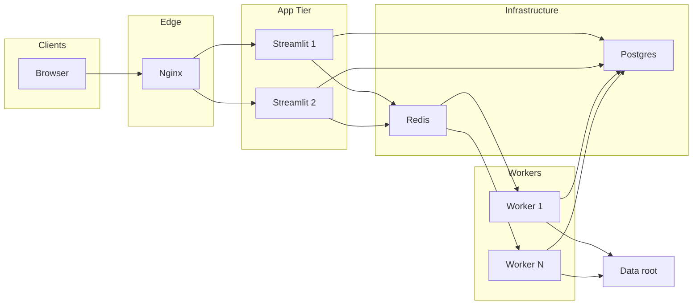

# Production Deployment Guide

This document describes how to build and deploy the evaluation dashboard in a **production-style** setup: **Nginx → Streamlit → Redis (task queue) → Worker → Postgres**.

## Architecture



- **Nginx**: Reverse proxy and optional load balancing; terminates TLS in production.
- **Streamlit**: UI only; enqueues heavy work to Redis and reads task status from Postgres.
- **Redis**: Task queue (RQ). Streamlit enqueues jobs; workers consume them.
- **Worker**: Runs heavy tasks (downloads, eval_result, Summary/Score CSV, parquet build).
- **Postgres**: Stores task metadata (status, result path, errors).

Heavy operations (download results, download scenarios, run eval_result, generate Summary/Score CSV, build parquet) are **not** run in the Streamlit process when the task queue is enabled. They run in the worker and status is visible in the UI under **Recent tasks**.

## Prerequisites

- Docker and Docker Compose
- (Optional) GitHub SSH key for building the image (private pip dependencies)
- (Optional) Server credentials for Download/Scenario API (`~/.webauto`)

## Environment Variables

| Variable | Description | Default |
|----------|-------------|---------|
| `EVAL_DASHBOARD_DATA_ROOT` | Root directory for evaluation data (must be same path in Streamlit and Worker) | `/app/data` in compose |
| `USE_TASK_QUEUE` | Set to `true` to use Redis + Worker + Postgres | `true` in compose |
| `DATABASE_URL` | Postgres connection string | Required when `USE_TASK_QUEUE=true` |
| `REDIS_URL` | Redis connection string | `redis://redis:6379/0` in compose |
| `RQ_QUEUE` | RQ queue name | `default` |
| `RQ_JOB_TIMEOUT_SEC` | Max runtime (seconds) for **every** RQ job before the worker terminates it. RQ’s built-in default (~180s) is too short for eval and downloads; the app defaults to **7 days** when unset. | `604800` (7d) |
| `RQ_BUILD_PARQUET_TIMEOUT_SEC` | Optional override for **build_parquet** only; if unset, uses `RQ_JOB_TIMEOUT_SEC` / the same 7-day default. | (same as `RQ_JOB_TIMEOUT_SEC`) |
| `POSTGRES_USER` | Postgres user (for postgres service) | `eval_user` |
| `POSTGRES_PASSWORD` | Postgres password | `eval_pass` |
| `POSTGRES_DB` | Postgres database name | `eval_dashboard` |
| `AUTH_USER_HEADER` | HTTP header name for current user (e.g. `X-Forwarded-User`). When set, users see only their own tasks. | (none) |
| `AUTH_DEFAULT_USER` | Fallback user id when header is not set (e.g. for dev). | (none) |
| `EVAL_DEPLOYMENT_DEBUG_DOCKER` | Set to `1` in [`deploy/docker-compose.yml`](deploy/docker-compose.yml) for Streamlit; enables the **Docker** tab when the host socket is mounted. Override in `.env` only if you change compose. | `1` in compose |
| `EVAL_DEPLOYMENT_DEBUG_COMPOSE_PROJECT` | Compose project name (`docker compose ls`) to filter containers by `com.docker.compose.project`. Strongly recommended when the host runs other stacks. | (empty) |
| `EVAL_DEPLOYMENT_DEBUG_EXEC` | When `1`/`true`, the Deployment debug **Docker** tab shows **Run command** (`sh -c` via `docker exec`). Default `0` in compose — enable in `.env` only briefly on trusted networks. | `0` |

## Build

Build the image from the **evaluation_dashboard_app** directory. For private GitHub dependencies, pass your SSH key:

```sh
cd evaluation_dashboard_app

# With private deps (webauto-auth, perception_eval, etc.)
docker build --no-cache --secret id=ssh,src=$HOME/.ssh/id_rsa -t evaluation-dashboard .

# Optional: different ROS distro
docker build --build-arg ROS_DISTRO=iron --secret id=ssh,src=$HOME/.ssh/id_rsa -t evaluation-dashboard .

docker compose build --no-cache
```

## Deploy with Docker Compose

1. **Copy env file and set values**

   ```sh
   cd deploy
   cp .env.example .env
   # Edit .env: set POSTGRES_PASSWORD, DATABASE_URL, and EVAL_DASHBOARD_DATA_ROOT if needed.
   ```

2. **Create Postgres task table (one-time)**

   ```sh
   docker compose up -d postgres
   # Wait for healthy
   docker compose run --rm init_db
   ```

3. **Start the stack**

   ```sh
   docker compose up -d
   ```

   To run multiple workers, use `--scale worker=N` (e.g. 3 workers):

   ```sh
   docker-compose up -d --scale worker=3
   ```

   Default is one worker. All worker replicas share the same RQ queue.

4. **Access the app**

   - Via Nginx: **http://localhost** (port 80)
   - Streamlit directly (if you expose it): port 8501 on the `streamlit` service (not exposed by default when using Nginx)

## Scaling

- **Workers**: Use Docker Compose `--scale` to run more worker containers. From the `deploy/` directory:
  - **Default (1 worker):** `docker-compose up -d`
  - **N workers:** `docker-compose up -d --scale worker=N`  
    Example: `docker-compose up -d --scale worker=3` runs three workers; all consume from the same RQ queue.
- **Streamlit replicas**: In `deploy/docker-compose.yml`, duplicate the `streamlit` service (e.g. `streamlit2`) and add `server streamlit2:8501;` to `deploy/nginx/nginx.conf` in the `upstream streamlit` block.

## TLS (HTTPS)

To serve over HTTPS, configure Nginx with SSL certificates (e.g. Let's Encrypt) and add a `server { listen 443 ssl; ... }` block in `deploy/nginx/nginx.conf`. Point your domain to the host and ensure port 443 is open.

## Running without the task queue (POC / single user)

- Do **not** set `USE_TASK_QUEUE` (or set it to `false`).
- Do **not** set `DATABASE_URL` / `REDIS_URL`.
- Run only the Streamlit container (e.g. `docker run ... evaluation-dashboard` as in the main Readme). Heavy tasks will run inline in the Streamlit process as before.

## Troubleshooting

| Issue | Check |
|-------|--------|
| "Failed to enqueue task" | `REDIS_URL` and `DATABASE_URL` are set; Redis and Postgres containers are running; `USE_TASK_QUEUE=true`. |
| Tasks stay "pending" | Worker container is running; same `REDIS_URL` and `RQ_QUEUE` as Streamlit; worker logs for errors. |
| Postgres connection refused | Postgres is healthy (`docker-compose ps`); `DATABASE_URL` uses hostname `postgres` and correct port (5432). |
| Nginx 502 Bad Gateway | Streamlit container is up and listening on 8501; Nginx `upstream` points to `streamlit:8501`. |

## Deployment debug page (Docker socket)

The Streamlit page **Deployment debug** (`pages/99_Deployment_Debug.py` — required at top level so `st.page_link` works; default sidebar entry is hidden outside Docker via CSS; **Overview** adds a sidebar link when running in Docker) shows redacted environment variables, Postgres/Redis/RQ checks, task counts, and Docker container status and log tails.

- [`deploy/docker-compose.yml`](deploy/docker-compose.yml) mounts `/var/run/docker.sock` into the `streamlit` service and sets `EVAL_DEPLOYMENT_DEBUG_DOCKER=1`. After `docker compose up -d`, restart or recreate Streamlit if you change compose or env.
- Set `EVAL_DEPLOYMENT_DEBUG_COMPOSE_PROJECT` in `.env` to your Compose project name (from `docker compose ls`) so the UI lists only this stack’s containers. If it is unset, the page lists every container visible to the daemon and shows a warning.
- Rebuild the image after adding the `docker` PyPI package to `requirements-docker.txt` (or `docker compose build streamlit`).
- **Exec**: set `EVAL_DEPLOYMENT_DEBUG_EXEC=1` in `.env` and recreate Streamlit to enable one-shot `sh -c` commands in the selected container (same power as `docker exec`). Leave at `0` when you only need logs.

**Risk**: any user who can open the app with socket access can read logs for containers matched by the filter. With `EVAL_DEPLOYMENT_DEBUG_EXEC=1`, they can also run shell commands inside those containers. Restrict access with VPN, SSO/auth proxy, or remove the socket mount and debug env from the `streamlit` service in compose if that risk is unacceptable.

## Data on the host (bind mounts)

When you run from `deploy/`, data is stored on your host so you can access it directly:

| Host path | Contents |
|-----------|----------|
| `evaluation_dashboard_app/data/` | Evaluation runs (Summary.csv, parquet, downloads). Same as the app default; shared by Streamlit and Worker. |
| `evaluation_dashboard_app/deploy/postgres_data/` | Postgres database files (including the `tasks` table for Recent tasks). Created on first `docker-compose up`. |
| `~/.webauto` (or `$HOME/.webauto`) | Download/Scenario API credentials. Mounted into Streamlit and Worker so Download tasks and scenario fetches work. Ensure this exists on the host before starting. |

Paths in compose are relative to `deploy/`: `../data`, `./postgres_data`, and `${HOME}/.webauto`. Do not commit `postgres_data/` (in `.gitignore`).

## Docker config (separate from local)

The app’s JSON config (e.g. Download page defaults) is read from a **different file** in Docker so your local `configs/autoware_evaluator_dl_config.json` is not used:

- **Env:** `EVAL_DASHBOARD_CONFIG=/app/docker_config/autoware_evaluator_dl_config.json`
- **File:** `deploy/configs/autoware_evaluator_dl_config.json` is mounted at `/app/docker_config/` in the container.

Edit `deploy/configs/autoware_evaluator_dl_config.json` for Docker defaults (e.g. `output_path`, `eval_root`). Use paths inside the container (e.g. `/app/data/download`). Your local config stays unchanged.

## Editing code without rebuilding

The compose file mounts the app source (`Overview.py`, `pages/`, `lib/`, `worker/`, `configs/`) into the Streamlit and worker containers. You can edit these files on the host and see changes without rebuilding the image:

- **Streamlit**: Saves to files under `pages/` or `lib/` are picked up automatically (Streamlit reloads).
- **Worker**: Restart the worker after changing `worker/` or `lib/`: `docker compose restart worker`.

Rebuild the image only when you change dependencies (e.g. `requirements-docker.txt`) or the Dockerfile.

## Directory layout (production)

```
deploy/
  docker-compose.yml                  # full stack; streamlit includes Docker socket for Deployment debug
  .env.example
  nginx/
    nginx.conf
  postgres_data/       # created at runtime; bind-mounted into postgres container
```


See also [MULTI_USER_DEPLOYMENT.md](MULTI_USER_DEPLOYMENT.md) for multi-user usage (shared data root, path safety, sharing links).
