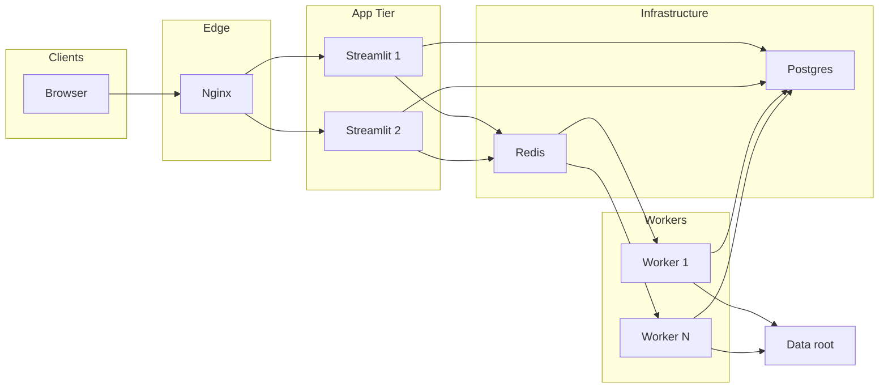

# Production Deployment Guide

This document describes how to build and deploy the evaluation dashboard in a **production-style** setup: **Nginx → Streamlit → Redis (task queue) → Worker → Postgres**.

## Architecture



- **Nginx**: Reverse proxy and optional load balancing; terminates TLS in production.
- **Streamlit**: UI only; enqueues heavy work to Redis and reads task status from Postgres.
- **Redis**: Task queue (RQ). Streamlit enqueues jobs; workers consume them.
- **Worker**: Runs heavy tasks (downloads, eval_result, Summary/Score CSV, parquet build).
- **Postgres**: Stores task metadata (status, result path, errors).

Heavy operations (download results, download scenarios, run eval_result, generate Summary/Score CSV, build parquet) are **not** run in the Streamlit process when the task queue is enabled. They run in the worker and status is visible in the UI under **Recent tasks**.

## Prerequisites

- Docker and Docker Compose
- (Optional) GitHub SSH key for building the image (private pip dependencies)
- (Optional) Server credentials for Download/Scenario API (`~/.webauto`)

## Environment Variables

| Variable | Description | Default |
|----------|-------------|---------|
| `EVAL_DASHBOARD_DATA_ROOT` | Root directory for evaluation data (must be same path in Streamlit and Worker) | `/app/data` in compose |
| `USE_TASK_QUEUE` | Set to `true` to use Redis + Worker + Postgres | `true` in compose |
| `DATABASE_URL` | Postgres connection string | Required when `USE_TASK_QUEUE=true` |
| `REDIS_URL` | Redis connection string | `redis://redis:6379/0` in compose |
| `RQ_QUEUE` | RQ queue name | `default` |
| `POSTGRES_USER` | Postgres user (for postgres service) | `eval_user` |
| `POSTGRES_PASSWORD` | Postgres password | `eval_pass` |
| `POSTGRES_DB` | Postgres database name | `eval_dashboard` |
| `AUTH_USER_HEADER` | HTTP header name for current user (e.g. `X-Forwarded-User`). When set, users see only their own tasks. | (none) |
| `AUTH_DEFAULT_USER` | Fallback user id when header is not set (e.g. for dev). | (none) |

## Build

Build the image from the **evaluation_dashboard_app** directory. For private GitHub dependencies, pass your SSH key:

```sh
cd evaluation_dashboard_app

# With private deps (webauto-auth, perception_eval, etc.)
docker build --no-cache --secret id=ssh,src=$HOME/.ssh/id_rsa -t evaluation-dashboard .

# Optional: different ROS distro
docker build --build-arg ROS_DISTRO=iron --secret id=ssh,src=$HOME/.ssh/id_rsa -t evaluation-dashboard .

docker compose build --no-cache
```

## Deploy with Docker Compose

1. **Copy env file and set values**

   ```sh
   cd deploy
   cp .env.example .env
   # Edit .env: set POSTGRES_PASSWORD, DATABASE_URL, and EVAL_DASHBOARD_DATA_ROOT if needed.
   ```

2. **Create Postgres task table (one-time)**

   ```sh
   docker compose up -d postgres
   # Wait for healthy
   docker compose run --rm init_db
   ```

3. **Start the stack**

   ```sh
   docker-compose up -d
   ```

   To run multiple workers, use `--scale worker=N` (e.g. 3 workers):

   ```sh
   docker-compose up -d --scale worker=3
   ```

   Default is one worker. All worker replicas share the same RQ queue.

4. **Access the app**

   - Via Nginx: **http://localhost** (port 80)
   - Streamlit directly (if you expose it): port 8501 on the `streamlit` service (not exposed by default when using Nginx)

## Scaling

- **Workers**: Use Docker Compose `--scale` to run more worker containers. From the `deploy/` directory:
  - **Default (1 worker):** `docker-compose up -d`
  - **N workers:** `docker-compose up -d --scale worker=N`  
    Example: `docker-compose up -d --scale worker=3` runs three workers; all consume from the same RQ queue.
- **Streamlit replicas**: In `deploy/docker-compose.yml`, duplicate the `streamlit` service (e.g. `streamlit2`) and add `server streamlit2:8501;` to `deploy/nginx/nginx.conf` in the `upstream streamlit` block.

## TLS (HTTPS)

To serve over HTTPS, configure Nginx with SSL certificates (e.g. Let's Encrypt) and add a `server { listen 443 ssl; ... }` block in `deploy/nginx/nginx.conf`. Point your domain to the host and ensure port 443 is open.

## Running without the task queue (POC / single user)

- Do **not** set `USE_TASK_QUEUE` (or set it to `false`).
- Do **not** set `DATABASE_URL` / `REDIS_URL`.
- Run only the Streamlit container (e.g. `docker run ... evaluation-dashboard` as in the main Readme). Heavy tasks will run inline in the Streamlit process as before.

## Troubleshooting

| Issue | Check |
|-------|--------|
| "Failed to enqueue task" | `REDIS_URL` and `DATABASE_URL` are set; Redis and Postgres containers are running; `USE_TASK_QUEUE=true`. |
| Tasks stay "pending" | Worker container is running; same `REDIS_URL` and `RQ_QUEUE` as Streamlit; worker logs for errors. |
| Postgres connection refused | Postgres is healthy (`docker-compose ps`); `DATABASE_URL` uses hostname `postgres` and correct port (5432). |
| Nginx 502 Bad Gateway | Streamlit container is up and listening on 8501; Nginx `upstream` points to `streamlit:8501`. |

## Data on the host (bind mounts)

When you run from `deploy/`, data is stored on your host so you can access it directly:

| Host path | Contents |
|-----------|----------|
| `evaluation_dashboard_app/data/` | Evaluation runs (Summary.csv, parquet, downloads). Same as the app default; shared by Streamlit and Worker. |
| `evaluation_dashboard_app/deploy/postgres_data/` | Postgres database files (including the `tasks` table for Recent tasks). Created on first `docker-compose up`. |
| `~/.webauto` (or `$HOME/.webauto`) | Download/Scenario API credentials. Mounted into Streamlit and Worker so Download tasks and scenario fetches work. Ensure this exists on the host before starting. |

Paths in compose are relative to `deploy/`: `../data`, `./postgres_data`, and `${HOME}/.webauto`. Do not commit `postgres_data/` (in `.gitignore`).

## Directory layout (production)

```
deploy/
  docker-compose.yml   # nginx, streamlit, redis, worker, postgres, init_db
  .env.example
  nginx/
    nginx.conf
  postgres_data/       # created at runtime; bind-mounted into postgres container
```

## Authentication (company auth / WebAutoAuth)

To let each user see **only their own tasks**, use your company auth (e.g. [WebAutoAuth](https://github.com/tier4/WebAutoAuth)) in front of the app so that the authenticated user id is passed to Streamlit.

1. **Auth proxy**: Put an auth proxy (or WebAutoAuth gateway) in front of Nginx/Streamlit. After login, the proxy sets an HTTP header with the user identity (e.g. `X-Forwarded-User: user@company.com`).
2. **App config**: Set `AUTH_USER_HEADER` to that header name (e.g. `X-Forwarded-User`). Streamlit (1.37+) reads it via `st.context.headers` and stores it as `session_id` when creating tasks; **Recent tasks** is then filtered by that id.
3. **Optional**: For local/dev without a proxy, set `AUTH_DEFAULT_USER=dev@example.com` so tasks are still attributed to a user.

Note: Download/Scenario API credentials (`webauto-auth-py`, `~/.webauto`) remain **server-side** for calling the Evaluator API. The above is for **app-level** user identity so each person sees their own task list.

See also [MULTI_USER_DEPLOYMENT.md](MULTI_USER_DEPLOYMENT.md) for multi-user usage (shared data root, path safety, sharing links).
